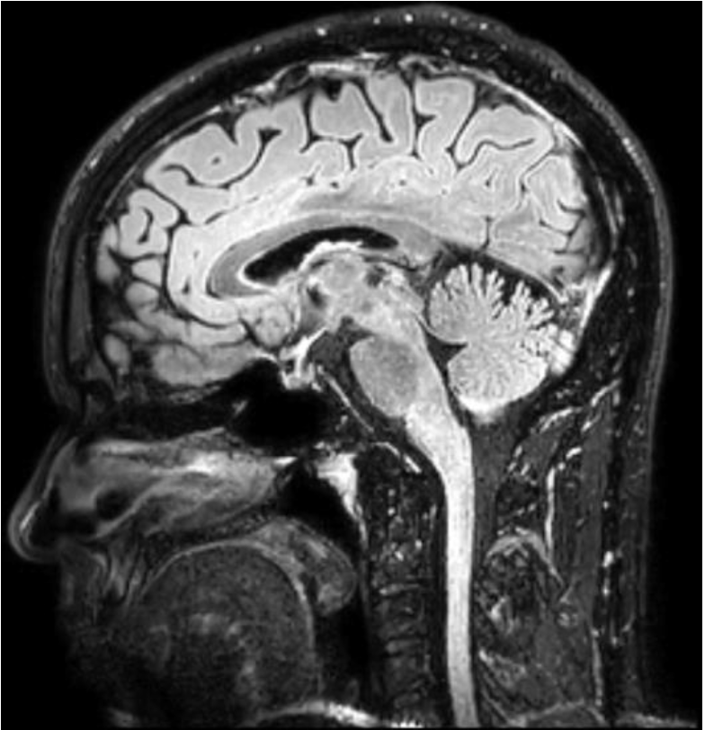

# MULTIPLE SCLEROSIS - EDSS Score Detection (JFRDataChallenge)
Multiple sclerosis (MS) is a chronic inflammatory disease of the central nervous system that causes the immune system to destroy the sheath of nerve fibres (myelin) in the brain, spinal cord and optic nerves. It is currently the leading cause of non-traumatic disability in young adults in France.
Myelin helps to accelerate the transmission of information between the brain and other parts of the body. This explains the appearance of neurological signs when it is altered. Symptoms vary according to the region affected, making the disease unpredictable for a given person. Currently, the correlations between imaging and disability data remain weak.

The EDSS (Expanded Disability Status Scale) remains the main clinical rating tool common to all neurologists for judging patient progress. The overall score of the scale is measured on a scale of 20 levels (0 to 10 per half point). Up to level 3.5, the score obtained in each FP (Functional Parameter) and the number of FPs achieved automatically determine the EDSS score. From 4 to 7, the definition of each level is also given by the inability to walk (ability to walk without stopping, need for help).2 More information on this score: https://www.edmus.org/fr/dl/scales/edmus_edss.pdf

## The Challenge
The obejective of the challenge was to create a ML/DL model that is capable of predicting the EDSS score of a given patient two years from now.

## The Data
The data contains 1461 MRI examinations (3D Flair and axial T2 Flair) with the EDSS score two years for  2 years (+/- 9 months) from the date of the exam. The MRIs were gathered from over 703 patients. Thus, the same patient may have several MRIs on different dates. The datasets can contain 3D Flair or T2 Flair axial examinations.

## Deep Learning
To tackle this task I took inspiration from 

## Resources

